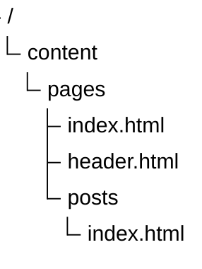
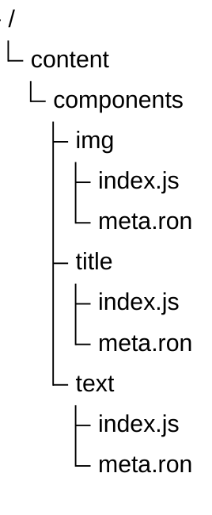
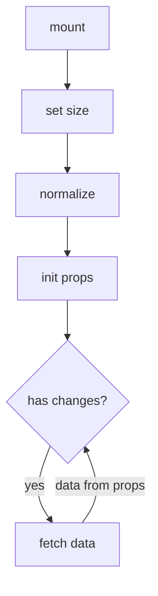
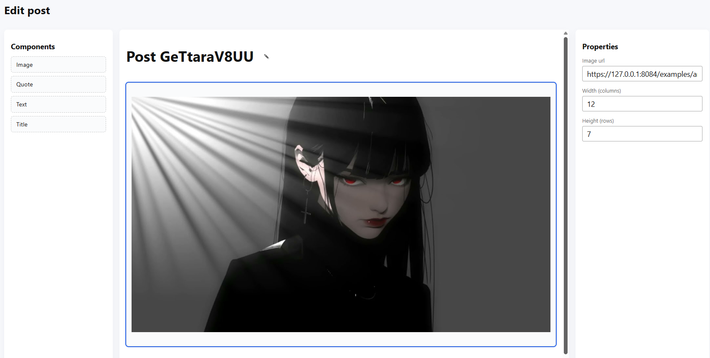

# About

Roffen is a little file-flat CMS for your personal blog. You can use it to create and manage your blog posts, and it
will help you to keep track of your content.

It means that you can easily create or modify an existing file so that the changes are applied in real time.

Alternatively, you can use the interactive article editor in the [admin panel](/admin/posts).

The pages editor is in development. You can follow the development process in
the [repository](https://github.com/Ertanic/roffen).

## Another plans

* translating
* adding more components
* adding themes support

---

# Pages

Since the page editor is still under development, you will have to create pages manually.

To do this, create an `index.html` file in `content/pages/`. This action will override the existing main page. To create
or override a subpage like `/posts`, create an `index.html` file in `content/pages/posts/`.

It is also worth noting that templates have the property of inheritance, which means that the `header.html` template can
also be used in `content/pages/posts/index.html`.



## Templates

The engine uses upon for page templates, which is a simple yet powerful engine. You can read more about it in
its [documentation](https://docs.rs/upon/latest/upon/).

Let's talk about the functions that are implemented and registered in the engine.

* `is_map(val) -> bool` - checks if the current value is a map.
* `len(val) -> i64` - get the length of the current value.
* `date(timestamp, format) -> string` - formats a timestamp into a date string.
* `eq(left, right) -> bool` - checks if two values are equal.
* `and(first, second) -> bool` - checks if two values are both true.
* `default<T>(val, default) -> T` - returns the default value if the current value is empty.
* `all_posts() -> Post[]` - returns all posts.
* `posts(count, offset) -> Post[]` - returns a list of posts.
* `get_post_by_id(id) -> Post` - returns a post by its ID.
* `get_pages() -> Page` - returns all pages.

In addition to functions, the following values are passed to templates:

* `auth: Option<JwtPayload>` - authentication status.
* `query: Map<string, string>` - query parameters.

> If you don't have any functions or values in the template engine, you can always manually add them. See
> this [file](https://github.com/Ertanic/roffen/blob/f60b9db7f066b3ba674662b2263b1770ed2c3ccf/server/src/templates/functions.rs)
> and the project [build](#build) method.

Let's now look at the fields of structures that are returned from functions and constants.

```rust
struct Post {
    id: String,
    content: {
       draft: bool,
       author: String,
       created_at: u64,
       updated_at: Option<u64>,
       title: String,
       content: Vec<PostComponent>,
   },
}

struct PostComponent {
    name: String,
    data: HashMap<String, String>,
}

struct Page {
    link: String,
    path: VfsPath,
    tags: Vec<String>,
}

struct JwtPayload {
    pub username: String,
    pub exp: usize,
}
```

---

# Components

The engine is somewhat modular, which means that you can write your own components, connect them to the engine, and use
them in your own articles.

Each module must contain/compile `index.js` and `meta.ron` and be located in the corresponding directory under
`content/components/`.



First, let's explore the component's life cycle. In general, everything is clear here, except for the difference between
`mount` and `normalize`. The only difference is that `mount` is triggered by a drag event, while `normalize` is
triggered by page loading and converts the component according to its properties.



## Implementation

Let's try to implement the image component. To do this, create a project with the following content:

* `index.ts`

```typescript
import type {IComponentHooks} from "common/src/IComponent.ts";

export const hooks: IComponentHooks = {
    mount: ctx => {
        const previewEl = document.createElement("img");
        const source = ctx.data.source;

        if (!source) {
            console.error("no source link");
            return;
        }

        previewEl.src = source;

        ctx.el.classList.add("component-image");

        ctx.el.appendChild(previewEl);
    },
    setSize: ctx => {
        if (!ctx.data.row || !ctx.data.col) {
            console.warn("no row or column parameter in component");
            return;
        }

        ctx.setRow(Number(ctx.data.row));
        ctx.setCol(Number(ctx.data.col));
    },
    initProps: ctx => {
        ctx.createUrlSource(
            "Image url",
            ctx.data.source ?? (ctx.el.children.item(0) as HTMLImageElement)?.src,
            value => {
                const child = ctx.el.children.item(0) as HTMLImageElement;

                if (!child) {
                    console.error("no child element");
                    return;
                }

                if (value) {
                    child.src = value;
                    ctx.data.source = value;
                } else if (ctx.data.source) {
                    child.src = ctx.data.source;
                }
            });
    },
    fetchData: ctx => {
        const child = ctx.el.children.item(0) as HTMLImageElement;

        if (!child) {
            return {
                source: "",
            };
        } else {
            return {
                source: child.src,
            }
        }
    }
}
```

* `meta.ron`

```ron
ComponentMeta(
    name: "image",
    title: "Image",
    html: "img",
    defaults: {
        "source": "/editor/img/image-placeholder.png",
        "row": "4",
        "col": "6",
    }
)
```

Now we can use this component in the editor.



## Rendering

There are several things you need to do to render components on a page:

1. Add the required styles to the page.

```html

<link rel="stylesheet" href="/view/css/styles.css">
```

2. Declare components before all other scripts by generating a js array with the desired properties.

```handlebars

<script>
    const components = [
        
        {
            id: "{{ name }}",
            path: "/components/js/{{ name }}",
            html: "{{ component.meta.html }}",
            title: "{{ component.meta.title }}",
            data: {
            
            "{{ key }}": "{{ val }}",
            
        },
        
    ];
</script>

```

3. Next, you need to add the following script to your page.

```html

<script src="/view/js/index.js"></script>
```

4. Finally, you can use components by generating their data containers inside a container with the `.grid-content`
   class.

```handlebars
<div class="grid-content">
    

    <div data-type="{{ comp.name }}"
         
         data-{{ key }}="{{ val }}"
         
    ></div>

    
</div>
```

5. To view the results of the script, see the Posts page.

## Why

Why such difficulties? At first, I planned to make components using an embedded language, but I quickly abandoned this
idea because it would have complicated interaction with the DOM tree. Therefore, I had to use native JS/TS scripts to
give you complete freedom of action.

---

# Build

To build the project, you will need several things:

1. [rust toolchain](https://rust-lang.org/tools/install/)
2. [bun](https://bun.sh/)

If everything is installed, you can use the following command, which will compile both the server and all the typescript
code in release mode, optimizing the entire code.

```powershell
cargo build -r
```

Upon successful build, the executable file will appear in the `target/release/server(.exe)` path.

That's all, you won't need anything else in this directory, all resources from the `content/` folder are included in the
output executable file by default.

In debug mode, the project can be started with the following command. In this case, no optimizations or content
inclusion will be applied, so you can safely change the contents of this folder in live mode.

```powershell
cargo run
```
