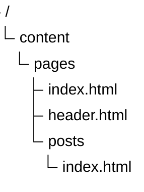
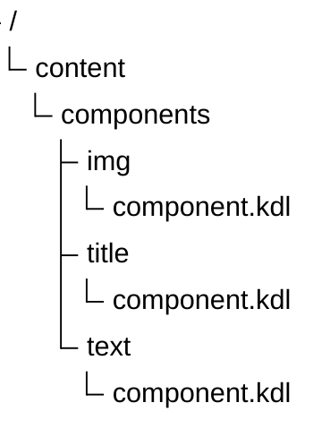

# About

Roffen is a little file-flat CMS for your personal blog. You can use it to create and manage your blog posts, and it
will help you to keep track of your content.

It means that you can easily create or modify an existing file so that the changes are applied in real time.

Alternatively, you can use the interactive article editor in the [admin panel](/admin/posts).

The pages editor is in development. You can follow the development process in
the [repository](https://github.com/Ertanic/roffen).

## Another plans

* adding more components
* adding themes support

---

# Config

The config file is a `config.toml` file that is located in the root of content folder. This file also has a hot reload
feature, which allows you to change some parameters on the fly.

## Auth

If you plan to change the values to non-standard ones, the config must contain the following. Otherwise, you won't be
able to access the admin panel.

```toml
[auth]
secret = "super-secret-key-change-me"

[[users]]
login = "admin"
password = "admin"
```

## TLS

If you plan to run the server over HTTPS, you should specify the path to the server certificates. Both relative and
absolute paths are accepted.

```toml
[tls]
cert = "server-cert.pem"
key = "server-key.pem"
```

## Server

By default, the server listens on the 0.0.0.0 address. The port depends on the use of HTTPS: if the paths to the
certificates are specified, port 443 is used; otherwise, port 80 is used. To specify a different address or port, you
can use the following values in the config.

```toml
[server]
address = "0.0.0.0"
port = 8443
```

## Lang

Some parts of the interface also have localization support. To enable it, you can specify the following:

```toml
[lang]
current = "en-US"
```

There is also a fallback language setting that the system will use if no translation key is found in the current
language.

```toml
[lang]
current = "ru-RU"
default = "en-US"
```

## Default

By default, the config looks like this. You can copy it from here if you only need to change a few values.

```toml
[lang]
current = "en-US"

[tls]
cert = "server-cert.pem"
key = "server-key.pem"

[auth]
secret = "super-secret-key-change-me"

[[users]]
login = "admin"
password = "admin"
```

---

# Pages

Since the page editor is still under development, you will have to create pages manually.

To do this, create an `index.html` file in `content/pages/`. This action will override the existing main page. To create
or override a subpage like `/posts`, create an `index.html` file in `content/pages/posts/`.

It is also worth noting that templates have the property of inheritance, which means that the `header.html` template can
also be used in `content/pages/posts/index.html`.



## Templates

The engine uses upon for page templates, which is a simple yet powerful engine. You can read more about it in
its [documentation](https://docs.rs/upon/latest/upon/).

Let's talk about the functions that are implemented and registered in the engine.

* `is_map(val) -> bool` - checks if the current value is a map.
* `len(val) -> i64` - get the length of the current value.
* `date(timestamp, format) -> string` - formats a timestamp into a date string.
* `eq(left, right) -> bool` - checks if two values are equal.
* `and(first, second) -> bool` - checks if two values are both true.
* `default<T>(val, default) -> T` - returns the default value if the current value is empty.
* `all_posts() -> Post[]` - returns all posts.
* `posts(count, offset) -> Post[]` - returns a list of posts.
* `get_post_by_id(id) -> Post` - returns a post by its ID.
* `get_pages() -> Page` - returns all pages.
* `get_components()` - returns all components.
* `render_component(components, component_data, component_name)` - renders a component.
* `lang(ftl_key)` - returns a translation by fluent key.

In addition to functions, the following values are passed to templates:

* `auth: Option<JwtPayload>` - authentication status.
* `query: Map<string, string>` - query parameters.
* `params: Map<string, string>` - route parameters.

> If you don't have any functions or values in the template engine, you can always manually add them. See
> this [file](https://github.com/Ertanic/roffen/blob/f60b9db7f066b3ba674662b2263b1770ed2c3ccf/server/src/templates/functions.rs)
> and the project [build](#build) method.

Let's now look at the fields of structures that are returned from functions and constants.

```rust
struct Post {
    id: String,
    content: {
       draft: bool,
       author: String,
       created_at: u64,
       updated_at: Option<u64>,
       title: String,
       content: Vec<PostComponent>,
   },
}

struct PostComponent {
    name: String,
    data: HashMap<String, String>,
}

struct Page {
    link: String,
    path: VfsPath,
    tags: Vec<String>,
}

struct JwtPayload {
    pub username: String,
    pub exp: usize,
}
```

---

# Components

The engine is somewhat modular, which means that you can write your own components, connect them to the engine, and use
them in your own articles.

Each module must contain a `component.kdl` file and be located in the corresponding directory in the
`content/components/` folder.



## Implementation

Let's try to implement the image component. Therefore, I suggest that you first look at the component description
syntax. The component description is written in [kdl](https://kdl.dev/).

The component description begins with the name of the component itself and the translation key for the component name.

```kdl
component "Name" {
    lang-key "components-name"
}
```

### Required

Next, you must describe the HTML structure of the component. You can use the `html` keyword to describe the HTML
structure. The next component will generate a `div` with specific classes.

```kdl
component "Name" {
    lang-key "components-name"

    html "div" {
        attr "class" "component-name"
    }
}
```

A component can have child components, which can be described using the `children` statement. Let's describe a list
item. To prevent it from being empty, use the `content` statement inside the `children` section.

```kdl
component "Name" {
    lang-key "components-name"

    html "div" {
        attr "class" "component-name"
        children {
            html "ul" {
                children {
                    html "li" {
                        children {
                            content "First item"
                        }
                    }
                    html "li" {
                        children {
                            content "Second item"
                        }
                    }
                }
            }
        }
    }
}
```

In general, the component can already be used, but if you need to set a value manually, you can use properties.
Properties are quite useful on their own, as they allow you to implement reactive interaction with HTML code without
additional lines of JS code, which can be useful in some cases.

Using this `#name` or this `#(name)` syntax, you can integrate property values directly into your HTML code. As an
example, you can use this syntax directly in HTML tags, changing them on the fly, as is done with `h#number`, which will
result in `h1`.

```kdl
component "Name" {
    lang-key "components-name"

    (url)property "url" {
        lang-key "components-name-property-url"
        default "/some-url.html"
    }

    (string)property "text" {
        lang-key "components-name-property-title"
        default "Some text"
    }

    (number)property "number" {
        lang-key "components-name-property-number"
        default "1"
        min "1"
        max "6"
    }

    html "div" {
        attr "class" "component-name"
        children {
            html "h#number" {
                children {
                    content "#text"
                }
            }
            html "ul" {
                children {
                    html "li" {
                        children {
                            content "First <a href=\"#url\">link</a>"
                        }
                    }
                    html "li" {
                        children {
                            content "#text"
                        }
                    }
                }
            }
        }
    }
}
```

### Optional

Optionally, you can specify additional properties for the component container. Yes, the component's HTML code is not
directly generated in another part of the markup; it is generated within the `div.grid-block`. To interact with this
block, you can use the `container` statement and reassign some default values.

```kdl
component "Image" {
    lang-key "components-image"

    container {
        row "8"
        classes "component-image-center-container"
    }

    (url)property "url" {
        lang-key "components-image-property-url"
        default "/editor/img/image-placeholder.png"
    }
   
    html "img" {
        attr "class" "component-image"
        attr "src" "#url"
    }
}
```

Now we can use this component in the editor.


## Rendering

There are several things you need to do to render components on a page:

1. Add the required styles to the page.

```html

<link rel="stylesheet" href="/view/css/styles.css">
```

2. Get a list of all the components.

```handlebars

   <!-- ... -->

```

3. Iterate over the post content.

```handlebars

   
      <!-- ... -->
   

```

4. Call a special function to generate HTML code.

```handlebars

   
      {{ render_component(components, comp.data, comp.name) }}
   

```

5. To view the results of the script, see the Posts page.

---

# Build

To build the project, you will need several things:

1. [rust toolchain](https://rust-lang.org/tools/install/)
2. [bun](https://bun.sh/)

If everything is installed, you can use the following command, which will compile both the server and all the typescript
code in release mode, optimizing the entire code.

```powershell
cargo build -r
```

Upon successful build, the executable file will appear in the `target/release/server(.exe)` path.

That's all, you won't need anything else in this directory, all resources from the `content/` folder are included in the
output executable file by default.

In debug mode, the project can be started with the following command. In this case, no optimizations or content
inclusion will be applied, so you can safely change the contents of this folder in live mode.

```powershell
cargo run
```
